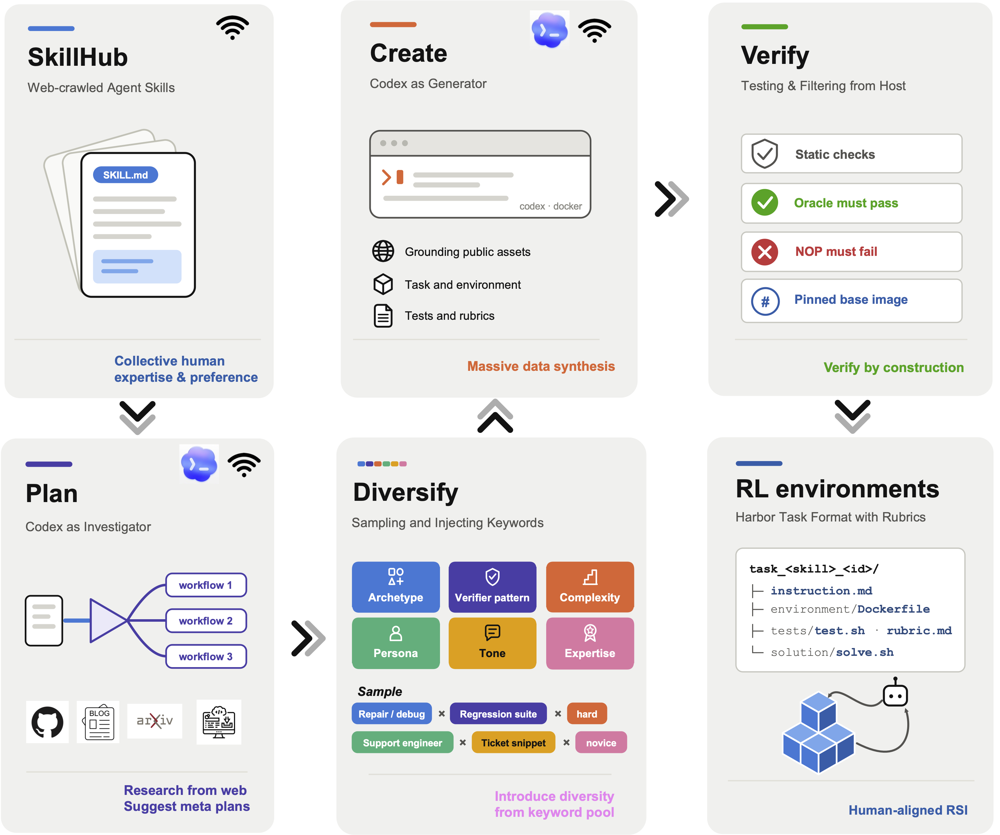

<p align="center">
  
</p>

<p align="center">
<a href="https://www.apache.org/licenses/LICENSE-2.0"></a>
<a href="?"></a>
<a href=""></a>
<a href="?"></a>

Skill2Env turns any [Agent Skill](https://agentskills.io) into RL-ready terminal tasks in the [Harbor](https://harborframework.com) format.

<p align="center">
  
</p>

## Requirements

- Linux host with Docker running (`docker info` works). 
- Python 3.12+ and [`uv`](https://docs.astral.sh/uv/).
- A Codex login at `~/.codex/auth.json` (see below). The Codex agents inside the containers use this file for authentication.
- Internet access while generating: planner and creator containers research and download public assets. 

## Install

```bash
git clone git@github.com:NVlabs/Skill2Env.git
cd Skill2Env
uv sync
```

## Authenticate Codex

Install the Codex CLI and sign in once. This writes `~/.codex/auth.json`, which `skill2env` bind-mounts
into every agent container:

```bash
npm install -g @openai/codex
codex login
```

On a headless server, sign in on a machine with a browser and copy `~/.codex/auth.json` to the server
(or pass `--auth-json /path/to/auth.json`).

Also log in to Docker Hub so base-image resolution uses your authenticated pull quota.

```bash
docker login
```


## Quick start

Generate up to two tasks from one small sample Skill. Expect 20 to 30 minutes on a 4-CPU host (the
first run also builds the generator image, which adds a few minutes):

```bash
uv run skill2env generate \
  --input-root SkillHub/test_samples/game-developer \
  --out output/quickstart \
  --max-tasks-per-skill 2 \
  --max-parallel-workers 2
```

The command prints the private run directory (`.skill2env/runs/<run-id>/`) at startup and a JSON
summary at the end. A successful run has `retained_tasks >= 1`, and each retained task lands under
`output/quickstart/`:

```text
output/quickstart/
├── _corpus_manifest.json
└── task_query_<8-char-id>/
    ├── instruction.md
    ├── task.toml
    ├── environment/
    │   ├── Dockerfile
    │   └── ... fixtures and setup files
    ├── tests/
    │   ├── test.sh
    │   ├── rubric.md
    │   └── ... optional verifier helpers
    └── solution/
        ├── solve.sh
        └── ... optional solution helpers
```


## Generate from [SkillHub](./SkillHub/)

`SkillHub/skills/` contains license-friendly Skill folders (see [`SkillHub/README.md`](SkillHub/README.md)).
`--input-root` is scanned recursively, so it can point at one Skill, one family, or the whole hub:

```bash
uv run skill2env generate \
  --input-root SkillHub/skills \
  --out output/skillhub \
  --max-tasks-per-skill 2 \
  --max-parallel-workers 8 \
  --resume
```

Retained tasks keep the source hierarchy under `--out`. `--resume` skips every Skill that a previous
run into the same `--out` already finished, so interrupted batches continue where they stopped.

Start with a small `--max-parallel-workers` (about one per two CPU cores) and raise it only after
watching CPU, memory, Docker, and Codex rate-limit behavior.

### Options

| Flag | Default | Meaning |
| --- | --- | --- |
| `--max-tasks-per-skill N` | planner decides (≤ 8) | Cap on tasks per Skill |
| `--max-parallel-workers N` | 4 | Concurrent Codex agents (planner + creators) |
| `--max-task-size-mib N` | 128 | Reject completed tasks larger than this |
| `--model NAME` | `gpt-5.6-sol` | Codex model for planner and creators |
| `--reasoning-effort LEVEL` | `xhigh` | `low`, `medium`, `high`, `xhigh`, or `max` |
| `--creator-timeout-sec N` | 3600 | Wall-clock limit per Codex call |
| `--codex-max-attempts N` | 5 | Retries per Codex call on transient failures (rate limits, auth refresh races) |
| `--codex-retry-base-sec N` | 15 | First retry delay; doubles with jitter, capped at 5 minutes |
| `--auth-json PATH` | `~/.codex/auth.json` | Codex auth file to mount |
| `--codex-version VER` | pinned | Codex CLI version installed in the generator image |
| `--generator-image IMAGE` | built locally | Use a prebuilt generator image instead |
| `--run-dir PATH` | `.skill2env/runs/<run-id>` | Where private run state is written |
| `--resume` | off | Skip Skills already finished under `--out` |


## Submit tasks to the Harbor hub

```bash
harbor auth login                                  # once, GitHub sign-in
uv run skill2env submit output/quickstart --dry-run
uv run skill2env submit output/quickstart --org <your-org-name> --public # omit --public for a private submission
```


## Troubleshooting

Codex runs a nested sandbox inside its container. On Ubuntu hosts with AppArmor, allow unprivileged
user namespaces once and make it persistent:

```bash
sudo sysctl -w kernel.apparmor_restrict_unprivileged_userns=0
echo "kernel.apparmor_restrict_unprivileged_userns = 0" | sudo tee /etc/sysctl.d/99-skill2env-userns.conf
```

Without this, every creator shell command fails with
`bwrap: loopback: Failed RTM_NEWADDR: Operation not permitted` and tasks end in
`creator_contract_failed`.


## License

Project-owned source is licensed under [Apache-2.0](LICENSE). See the
[third-party notices](THIRD_PARTY_NOTICES.md) for skill2env's dependencies and container/build tools.

Third-party material in `SkillHub/` retains its respective copyright and license terms.
See the [source and license inventory](SkillHub/skillhub_source_licenses.csv),
[preserved license files](SkillHub/licenses/), and [SkillHub README](SkillHub/README.md).
