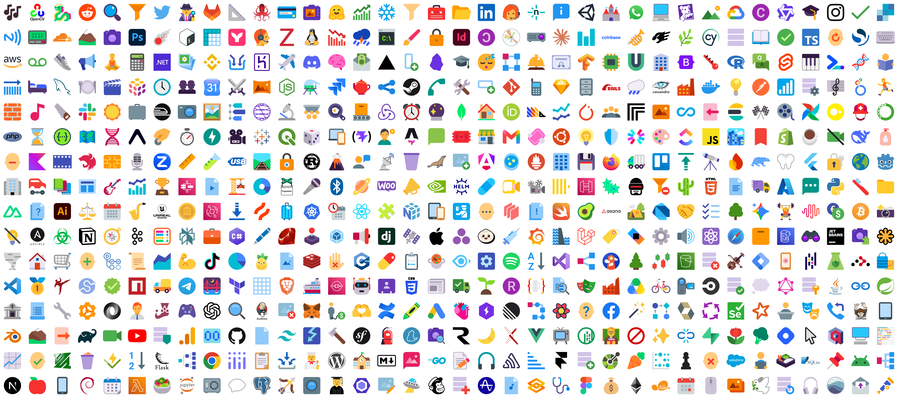

# SkillHub

SkillHub is a collection of open-source [Agent Skills](https://agentskills.io), each kept
as a clean, self-contained skill folder with its `SKILL.md` and bundled references, scripts, and
assets. We web-scraped a subset of publicly available skill repositories on GitHub, then filtered
the result for licensing, offline feasibility, and quality.

  

## Licensing

[`skillhub_source_licenses.csv`](skillhub_source_licenses.csv) records each retained
skill's path and license information, with original license files copied under [`licenses`](licenses).

## Filtering & Deduplication

Scraped skills were dropped if they fall into one of these categories, which cannot become
offline, self-contained terminal tasks:

- external account, API, login, token, subscription, or SaaS dependency
- physical hardware or real-world dependency
- persona, style, prompt, or copywriting-only workflow
- harmful, outreach, scraping, social-engineering, or policy-risk workflow

Near-duplicate skills were deduplicated based on N-gram coverage.

## Layout

| Path | Contents |
| --- | --- |
| `skills/` | 2,396 skills (some folders bundle several related skills) |
| `test_samples/` | sampled skills from `skills/` for smoke tests and the quick start |
| `skillhub_source_licenses.csv` | One row per `SKILL.md` in `skills/` identifying sources and licenses |

Point `skill2env generate --input-root` at any of these directories, or at a single skill folder.
